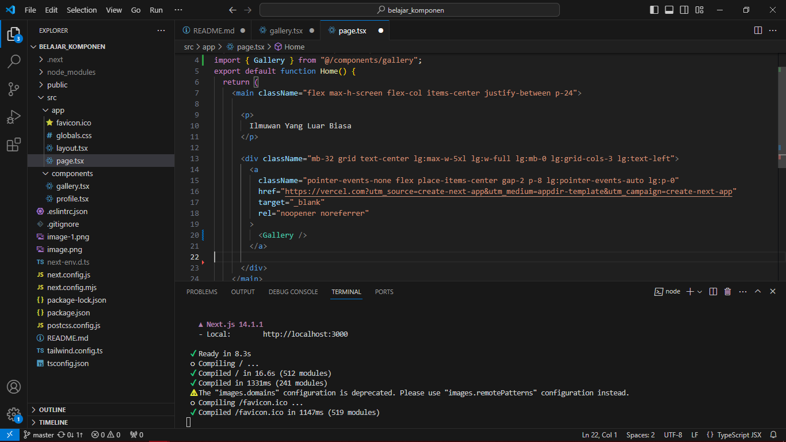
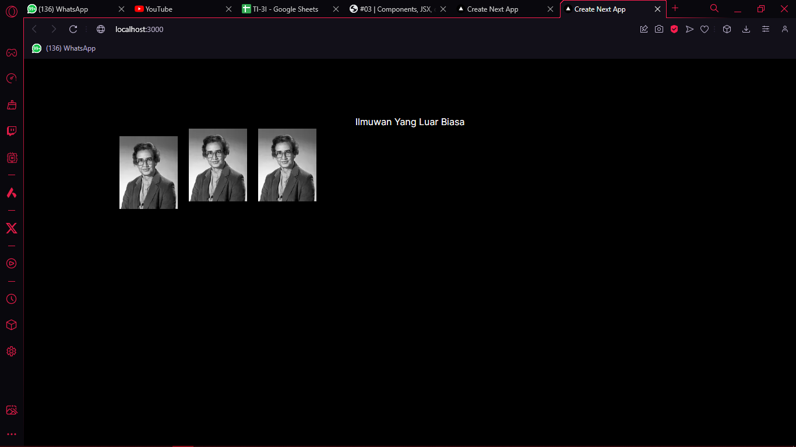
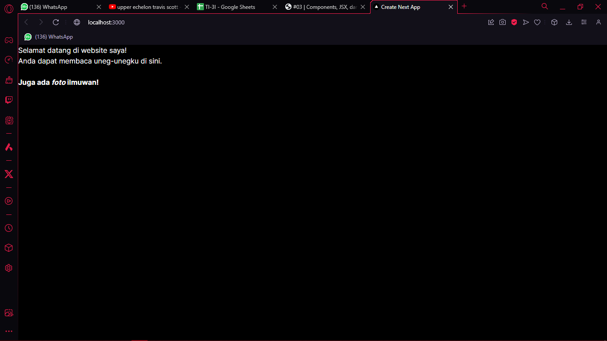
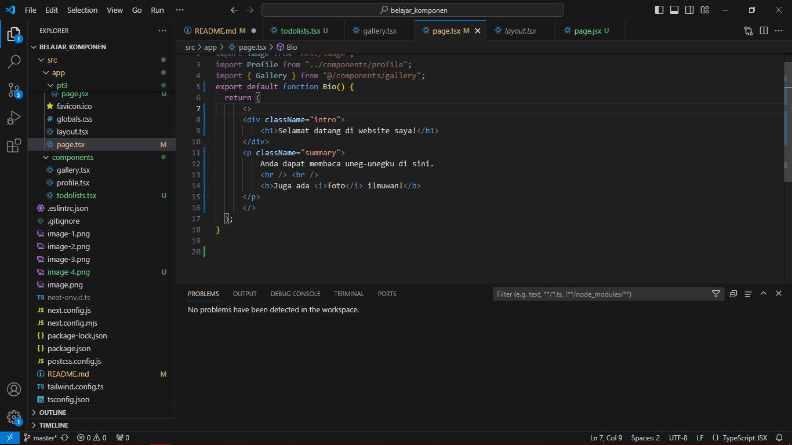

Soal 1
Ubah isi kode Home() sehingga dapat tampil seperti berikut dengan memanfaatkan komponen Profile() yang tadi sudah dibuat dari langkah 1 tersebut!

Hasil

Capture hasilnya dan buatlah laporan di README.md. Jelaskan apa yang telah Anda pelajari dan bagaimana Anda solve error tersebut?

Jawab:
Saya mampu mempelajari bahwa kita bisa membuat dan memakai komponen eksternal yang mana mudah digunakan 

Jangan lupa push dengan pesan commit: "W03: Jawaban soal 1".

Catatan:

Jika terjadi error, Anda dapat mengakses tautan ini sebagai petunjuk solusinya: https://nextjs.org/docs/app/building-your-application/optimizing/images#remote-images

Soal 2
Capture hasilnya dan buatlah laporan di README.md. Jelaskan apa yang telah Anda pelajari dan bagaimana tampilannya saat ini?

Jawaban:
berdasarkan soal no 2 dan apa yang saya bisa pelajar,user dapat mengunakkan komponen secara banyak dan berulang ulang kali,lalu mengenai perubahan interface yang dilakukan, terdapat perubahan yaitu gambar menjadi tidak rapi dikarenakan tidak adanya 
 pada code seperti pada praktikum sebelumnya 

Jangan lupa push dengan pesan commit: "W03: Jawaban soal 2".

Soal 3
"Please fix the following JSX code. You can use a converter or fix it manually."

Capture hasilnya dan buatlah laporan di README.md. Jelaskan apa yang telah Anda pelajari dan mengapa error itu bisa terjadi?

Jawaban:
error terjadi dikarenakan code perlu untuk di wrap pada jsx fragment dan merubah penamaan pada pclass="" menjadi pClassName=""

Jangan lupa push dengan pesan commit: "W03: Jawaban soal 3".