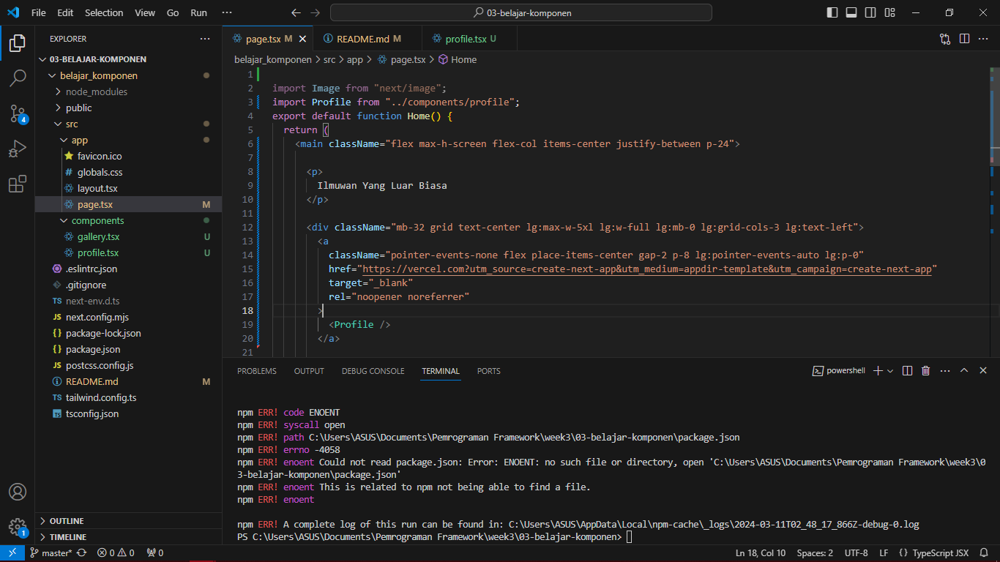

Soal 1
Ubah isi kode Home() sehingga dapat tampil seperti berikut dengan memanfaatkan komponen Profile() yang tadi sudah dibuat dari langkah 1 tersebut!

Hasil

Capture hasilnya dan buatlah laporan di README.md. Jelaskan apa yang telah Anda pelajari dan bagaimana Anda solve error tersebut?

Jawab:
Saya mampu mempelajari bahwa kita bisa membuat dan memakai komponen eksternal yang mana mudah digunakan 

Jangan lupa push dengan pesan commit: "W03: Jawaban soal 1".

Catatan:

Jika terjadi error, Anda dapat mengakses tautan ini sebagai petunjuk solusinya: https://nextjs.org/docs/app/building-your-application/optimizing/images#remote-images

Soal 2
Capture hasilnya dan buatlah laporan di README.md. Jelaskan apa yang telah Anda pelajari dan bagaimana tampilannya saat ini?

Jangan lupa push dengan pesan commit: "W03: Jawaban soal 2".